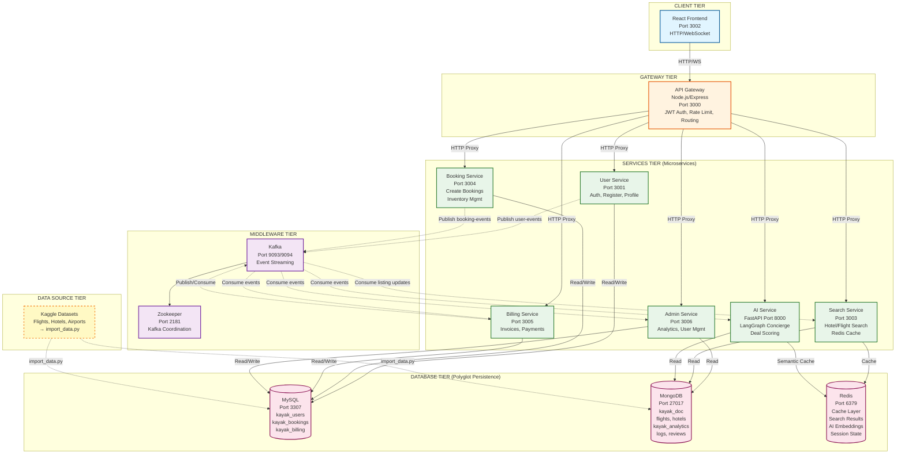

# Kayak System Architecture - Mermaid Diagram

This diagram can be rendered in GitHub, VS Code (with Mermaid extension), or online at [mermaid.live](https://mermaid.live).

## Legend

- **Solid arrows (→)**: Synchronous HTTP requests
- **Dashed arrows (-.->)**: Asynchronous Kafka events
- **Color coding**:
  - 🔵 Blue: Client tier
  - 🟠 Orange: Gateway tier
  - 🟢 Green: Services tier
  - 🟣 Purple: Middleware tier
  - 🔴 Red: Database tier
  - 🟡 Yellow: Data source tier

## Key Connections Explained

### Synchronous Request Flow
1. **Client → API Gateway**: All requests go through gateway for auth/routing
2. **API Gateway → Services**: Routes to appropriate microservice
3. **Services → Databases**: Direct DB connections for reads/writes

### Asynchronous Event Flow
1. **User Service** publishes user registration/login events
2. **Booking Service** publishes booking lifecycle events
3. **Search Service** consumes listing updates to refresh read model
4. **Billing Service** consumes booking events to create invoices
5. **Admin Service** consumes events for analytics aggregation
6. **AI Service** consumes events for context/real-time updates

### Cache Strategy
- **Search Service** caches query results in Redis (TTL: 300s)
- **AI Service** uses Redis for semantic cache (embeddings, TTL: 3600s)

